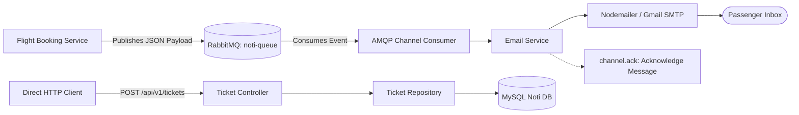
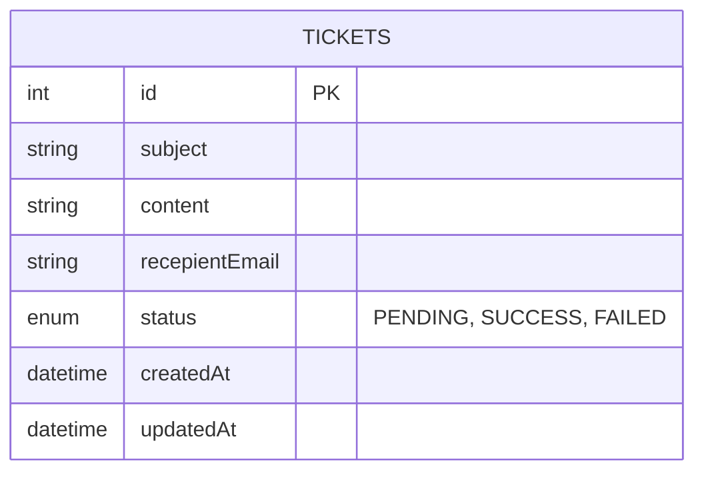

# Notification & Ticketing Service (`Noti-Service`)

The **Notification & Ticketing Service** is an asynchronous message consumer and email delivery worker. It ingests flight booking confirmation and recovery events from **RabbitMQ**, creates auditable notification ticket records in MySQL, and delivers customer-facing emails via **Nodemailer** using Gmail SMTP.

---

## 1. Tech Stack & Dependencies

- **Runtime & Framework:** Node.js (v18+), Express.js (`^5.2.1`)
- **Message Consumer:** RabbitMQ via `amqplib` (`^2.0.1`)
- **Email Delivery:** Nodemailer (`^10.0.10`) with Gmail SMTP Transporter
- **ORM & Database:** Sequelize (`^6.37.8`), `sequelize-cli` (`^6.6.5`), MySQL (`mysql2` `^3.22.5`)
- **Logging & Utilities:** Winston (`^3.19.0`), `http-status-codes` (`^2.3.0`), `dotenv` (`^17.4.2`)

---

## 2. Architecture & Asynchronous Event Ingestion

The Notification Service operates both as an HTTP REST service and as an asynchronous worker listening to RabbitMQ:



---

## 3. RabbitMQ Message Consumption & Processing Flow

### 1. Consumer Lifecycle
1. When the server boots on port `3002`, `connectQueue()` initializes a connection to `amqp://localhost`.
2. Creates an AMQP channel and asserts the durable queue `noti-queue`.
3. Sets up `channel.consume("noti-queue", async (data) => { ... })`.

### 2. Consumed Event Payload Schema
```json
{
  "subject": "Booking Confirmation",
  "text": "Booking successfully done for the flight 14",
  "recepientEmail": "passenger@example.com"
}
```

### 3. Email Delivery & Acknowledgement
```javascript
channel.consume("noti-queue", async (data) => {
  try {
    const payload = JSON.parse(`${Buffer.from(data.content)}`);
    await emailService.sendEmail({
      mailFrom: serverConfig.GMAIL_EMAIL,
      mailTo: payload.recepientEmail,
      subject: payload.subject,
      text: payload.text
    });
    // Explicit manual acknowledgment ensures zero message loss
    channel.ack(data);
  } catch (error) {
    console.error("Failed to process notification message:", error);
  }
});
```

---

## 4. Database Schema

The service maintains notification history and auditing records using the `Tickets` table:



- **`subject`** (STRING, Required): Email subject line.
- **`content`** (STRING, Required): Email body text / HTML.
- **`recepientEmail`** (STRING, Required): Destination email address.
- **`status`** (ENUM, Default: `'PENDING'`): Delivery state (`PENDING`, `SUCCESS`, `FAILED`).

---

## 5. Environment Variables & Setup

Create a `.env` file in `Noti-Service/`:

```env
PORT=3002
GMAIL_EMAIL=your_airline_notification_email@gmail.com
GMAIL_PASS=your_gmail_16_digit_app_password
```

> [!IMPORTANT]
> `GMAIL_PASS` requires a **Google App Password** generated from your Google Account Security settings (with 2-Factor Authentication enabled). Standard Gmail account passwords will be rejected by Google's SMTP servers.

### Database Configuration (`src/config/config.json`)
```json
{
  "development": {
    "username": "root",
    "password": "your_db_password",
    "database": "Flight_Notification_Dev",
    "host": "127.0.0.1",
    "dialect": "mysql"
  }
}
```

---

## 6. API Route Catalog & Endpoints

### 1. Create Notification Ticket
- **Method & Route:** `POST /api/v1/tickets`
- **Access:** Direct HTTP / Service-to-Service
- **Description:** Directly queues a notification ticket in the MySQL database in `PENDING` state.
- **Request Body:**
  ```json
  {
    "subject": "Flight Delay Alert",
    "content": "Your flight AI-202 has been delayed by 45 minutes.",
    "recepientEmail": "passenger@example.com"
  }
  ```
- **Success Response (`201 Created`):**
  ```json
  {
    "id": 1,
    "subject": "Flight Delay Alert",
    "content": "Your flight AI-202 has been delayed by 45 minutes.",
    "recepientEmail": "passenger@example.com",
    "status": "PENDING",
    "createdAt": "2026-09-26T01:25:00.000Z",
    "updatedAt": "2026-09-26T01:25:00.000Z"
  }
  ```

---

## 7. Setup & Execution

### Prerequisites
1. **RabbitMQ Broker:** Running on default port `5672` (`amqp://localhost`).
2. **MySQL Server:** Initialized and running.

### 1. Install Dependencies
```bash
cd Noti-Service
npm install
```

### 2. Run Database Migrations
```bash
npx sequelize db:migrate
```

### 3. Start Development Server
```bash
npm run dev
```
Upon startup, the console prints:
```text
Server is running on port 3002
connected to queue
```
The service is now listening for incoming HTTP requests and polling `noti-queue` for outbound emails.